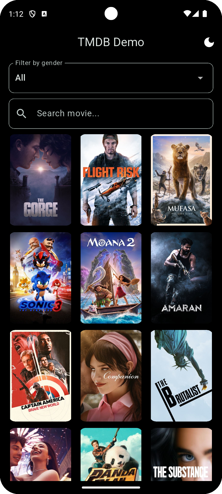
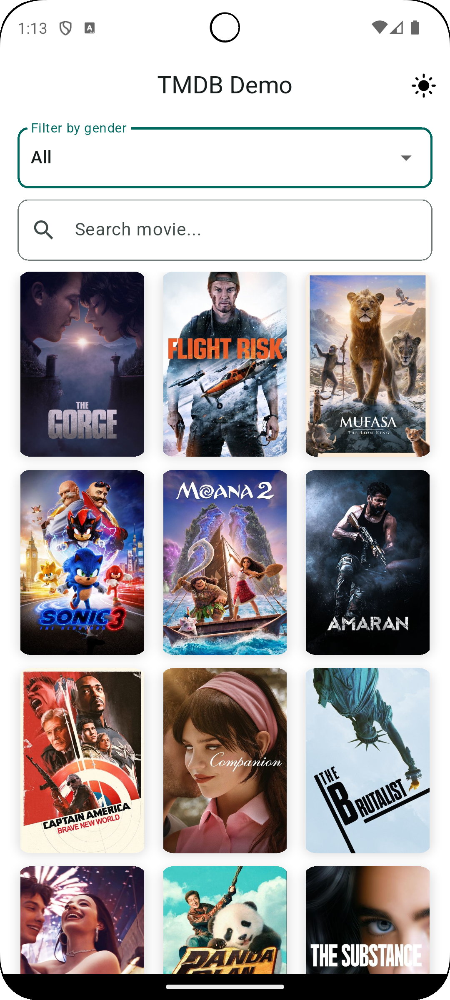
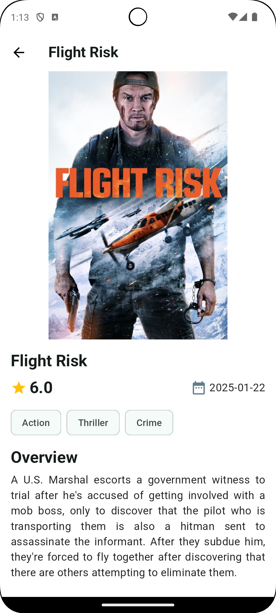

# 🎬 Flutter Movies App

> Application developed in Flutter that shows the most popular movies using the API of [The Movie Database (TMDB)](https://www.themoviedb.org/).

## 📌 Description
This application allows you to browse the most popular movies of the moment with search options, filtering by genre and viewing details. In addition, it has support for **dark and light mode**, image caching and data persistence.

## 🚀 Features
✅ **List of popular movies** obtained from TMDB API.  
✅ **Real-time search** for movies.  
✅ **Filtering by genre**.  
✅ **Pagination** to load more movies efficiently.  
✅ **Dark and light mode** with persistence of settings.  
✅ **Image caching** with `cached_network_image`.  
✅ **Local data persistence** using `Isar`.

## 🛠️ Technologies Used
- **Flutter** (Main Framework)
- **Dart** (Programming language)
- **State Management**: Riverpod
- **Networking**: Dio
- **Routing**: GoRouter
- **Local Storage**: Isar
- **Cached Image**: CachedNetworkImage
- **Configuration persistence**: SharedPreferences
- **API**: The Movie Database (TMDB)

---

## 📥 Installation and Configuration

### 🔹 1. Clone the repository
```sh
git clone https://github.com/JoshuaEGonzalezRuiz/flutter-movies-app.git
cd flutter-movies-app
```

### 🔹 2. Install dependencies
```sh
flutter pub get
```

### 🔹 3. Configuring the TMDB Bearer Token
Access the `api_config.dart` file and add your TMDB token:
```sh
static const String bearerToken = "YOUR TOKEN"
```

### 🔹 4. Run the application
```sh
flutter run
```

## 📂 Project Structure

```
lib/
│── core/ # Configurations and utilities.
│ ├─── config/ # API, Isar and dependencies configuration.
│ ├─── di/ # Injecting dependencies with Riverpod
│ ├─── theme/ # Theme management (dark/light).
│ ├─── routes/ # Routes configuration with GoRouter
│ ├─── utils/ # Utilities such as error handling and cache.
│─── data/ # Data access layer.
│ ├─── datasources/ # Connection to TMDB API and local base.
│ ├─── models/ # data models for TMDB
│ ├─── repositories/ # Repository implementation.
│─── domain/ # Business logic and entities.
│ ├─── entities/ # Domain core classes.
│ ├─── repositories/ # Repository interfaces.
│ ├─── usecases/ # Use cases.
│─── presentation/ # UI and state logic.
│ ├─── pages/ # Application screens.
│ ├─── widgets/ # Reusable components.
│ ├─── viewmodels/ # State management with Riverpod.
│─── main.dart # Application entry point.
```

## 🎥 Screenshots
### 📌 Dark Mode



### 📌 Clear Mode



## 📜 License

This project is under the MIT license. You can use and modify it freely. 😊

## 📌 Author

Developed by Joshua Gonzalez.